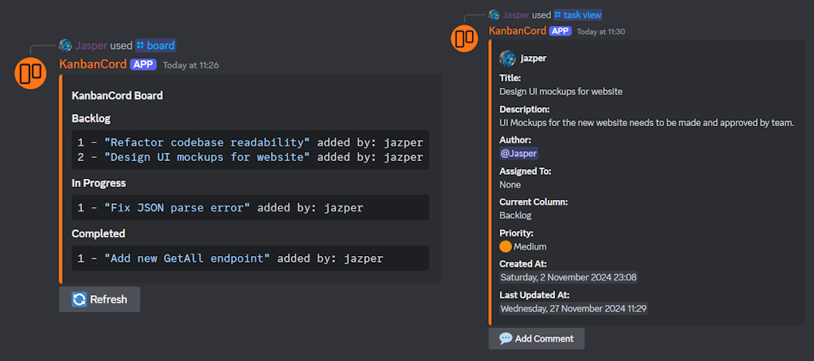

<a href="https://discord.com/oauth2/authorize?client_id=1301269207073165444">
  <p align="center">
    
  </p>
</a>

<h1 align="center">KanbanCord</h1>

<p align="center">
  A simple Kanban board, but on Discord. The idea came from <a href="https://github.com/seansylee" target="_blank">seansylee</a> who made <a href="https://github.com/seansylee/kanban-board-bot" target="_blank">kanban-board-bot</a> which is no longer maintained.
</p>

[](https://github.com/j4asper/KanbanCord/actions/workflows/build-and-publish-docker-image.yml)

[](https://discord.com/oauth2/authorize?client_id=1301269207073165444)



## Table of Contents

<!-- TOC -->
  * [Table of Contents](#table-of-contents)
  * [What is a Kanban Board](#what-is-a-kanban-board)
  * [Setup](#setup)
    * [Docker](#docker)
      * [Image](#image)
      * [Variables](#variables)
      * [Database](#database)
    * [Docker Compose](#docker-compose)
    * [Build from source](#build-from-source)
  * [Logs](#logs)
  * [Commands](#commands)
    * [General Commands](#general-commands)
    * [Task Management](#task-management)
<!-- TOC -->

## What is a Kanban Board

A Kanban board is a visual tool used to organize tasks and workflows. It typically consists of columns representing different stages of a process (e.g., "To Do," "In Progress," "Done"). Tasks are represented as cards that can be moved between columns as they progress. The KanbanCord Discord Bot brings this concept to Discord, allowing users to create and manage Kanban boards directly within their server for efficient task management and team collaboration.

## Setup

### Docker

#### Image

Docker image for KanbanCord is available on the docker hub here: https://hub.docker.com/r/jazper/kanbancord

#### Variables

These variables are Environment variables

| Variable                      | Description                                                                                  | Required | Default value |
|-------------------------------|----------------------------------------------------------------------------------------------|----------|---------------|
| `Discord__Token`              | Your discord application token (bot token).                                                  | Yes      | None          |
| `Discord__SupportInvite`      | Support discord server invite link. Not needed when self hosting.                            | No       | None          |
| `Database__ConnectionString`  | MongoDB Connection String eg. `mongodb://localhost:27017`.                                   | Yes      | None          |
| `Database__Name`              | MongoDB Database Name, if you want to change it from the default value.                      | No       | `KanbanCord`  |
| `UptimeMonitor__Enabled`      | Whether to enable the uptime monitor, made for uptime kuma, but may work for other services. | No       | `false`       |
| `UptimeMonitor__PushUrl`      | The Url to make a request to for the uptime monitor.                                         | No       | None          |
| `UptimeMonitor__PushInterval` | A TimeSpan interval for making requests to the uptime monitor push url.                      | No       | 1 Minute      |

#### Database

A [MongoDB](https://www.mongodb.com/) is required for this bot to run. [A Docker image is available here](https://hub.docker.com/r/mongodb/mongodb-community-server).

KanbanCord will automatically create the required collections on startup, if they are missing.

| Collection Name |
|-----------------|
| Tasks           |
| Settings        |

### Docker Compose

A docker-compose file is available here: [docker-compose.yml](docker-compose.yml). This will setup the bot and a MongoDB database, the only thing you have to do, is to update the bot token.

### Build from source

You will need to clone the repository first:

```console
git clone https://github.com/j4asper/KanbanCord
```

Then you need to build the docker image, you need to be in the same directory as the [Dockerfile](Dockerfile):

```console
docker build -t kanbancord .
```

Now you can run the bot, and add the required environment variables:

```console
docker run -d -e Discord__Token=your-bot-token -e Database__ConnectionString=your-mongodb-connection-string kanbancord
```

## Logs

The bot uses **Serilog** for logging, with the default log file written to `/logs/kanbancord-log.txt`. You can customize the logging settings through the [appsettings.json](KanbanCord.Bot/appsettings.json) file or override them using environment variables that follow the configuration structure. If you're running the bot in a Docker container, you can bind the log file path to the container to easily access and review the logs. For more information on configuring environment variables, check the official [ASP.NET Core Configuration documentation](https://learn.microsoft.com/en-us/aspnet/core/fundamentals/configuration/?view=aspnetcore-9.0#naming-of-environment-variables).

## Commands

Commands with a star (*) after the name require the user to have the **Manage Messages** permission on the Discord server.

You can also customize the accessibility of the commands in your server settings. To do so, go to **Server Settings** > **Integrations** > **KanbanCord**. Here, you can choose specific commands and restrict them to certain roles or channels as needed.

### General Commands

- `/board`  
  Displays the Kanban board with all tasks.
  
- `/archive`  
  Displays all archived tasks.

- `/repository`  
  Get the repository URL and additional information about the bot.

- `/stats`  
  Displays bot statistics (e.g., task count, active users, etc.).

### Task Management

- `/clear` *  
  Clears the Kanban board completely, archiving all current tasks.

- `/reset` *  
  Resets the Kanban board, deleting all current and archived tasks.

- `/task add` *  
  Add a new task to the backlog.

- `/task edit` *  
  Edit a task's title and/or description.

- `/task delete` *  
  Completely deletes a task, bypassing the archive and making it unrecoverable.

- `/task view`  
  View detailed information about a task, including description, author, and comments.

- `/task start` *  
  Move a task from the Backlog to In-Progress.

- `/task complete` *  
  Move a task from In-Progress to Completed.

- `/task archive` *  
  Archive a task and move it to the archived tasks list.

- `/task move` *  
  Move a task between columns (e.g., Backlog, In-Progress, Completed).

- `/task assign` *  
  Assign a task to a specific user.

- `/task me` *  
  View all tasks assigned to you.

- `/task user`  
  View all tasks assigned to a specified user.

- `/task priority` *  
  Set or adjust the priority level of a task.

- `/task comment` *  
  Add a comment to a task.
